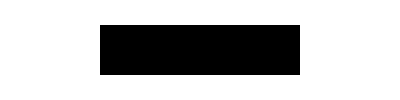

<!-- README.md is generated from README.Rmd. Please edit that file -->

```{r, include = FALSE}
knitr::opts_chunk$set(
  collapse = TRUE,
  comment = "#>",
  fig.path = "man/figures/README-",
  out.width = "100%"
)

suppressPackageStartupMessages({
  library(dplyr)
  library(ggplot2)
  library(tidyr)
  
  library(minisvg)
  library(svgfilter)
})

set.seed(1) 
```


```{r echo = FALSE, eval = FALSE}
# pkgdown::build_site(override = list(destination = "../coolbutuseless.github.io/package/svgfilter"))
```


# svgfilter   

<!-- badges: start -->


<!-- badges: end -->

`svgfilter` provides some basic SVG filters.

Because github sanitises SVG to remove some elements of style, scripting and animation,
please see the [svgfilter pkgdown website](https://coolbutuseless.github.io/package/svgfilter/index.html)
to view the animations.

Creating interesting filters is a bit of an art-form, so this package provides
a few simple filters to show how they operate.

This packages is not at all meant to be a comprehensive set of all possible filters, 
but merely some examples to show the way.

The following filters are provided in this package:

* Turbulent displacement (as shown in the hex logo) - 
  `create_filter_turbulent_displacement()`
* Gaussian Blur - `create_filter_blur()`
* Drop Shadow - `create_filter_drop_shadow()`

## Installation

You can install from [GitHub](https://github.com/coolbutuseless/svgfilter) with:

``` r
# install.packages("devtools")
devtools::install_github("coolbutuseless/minisvg")   # Build SVG documents with R
devtools::install_github("coolbutuseless/svgfilter") # This package
```


## Blur filter

```{r}
my_filter <- create_filter_blur(id = "example-blur")

my_filter$save_full_svg("man/figures/README-eg-blur.svg", height=100, include_declaration = FALSE)
```


```{r echo=FALSE, results='asis'}
cat(
  "<pre>",
  "<details closed><summary style='color: #4169E1;'> Show/hide SVG text </summary>",
  htmltools::htmlEscape(as.character(my_filter)),
  "</details>",
  "</pre>", sep='')
```





#### Applying the filter

```{r}
doc <- svg_doc(width=300, height = 200)
doc$defs(my_filter)

doc$circle(
  id     = "my circle",
  cx     = 100, 
  cy     = 100,
  r      = 50, 
  fill   = '#002366',
  filter = my_filter
)

doc$save("man/figures/README-doc-blur.svg")
```

```{r echo=FALSE, results='asis'}
cat(
  "<pre>",
  "<details closed><summary style='color: #4169E1;'> Show/hide SVG text </summary>",
  htmltools::htmlEscape(as.character(doc)),
  "</details>",
  "</pre>", sep='')
```


## Drop Shadow filter

```{r}
my_filter <- create_filter_drop_shadow(id = "example-drop")

my_filter$save_full_svg("man/figures/README-eg-drop.svg", height=100, include_declaration = FALSE)
```


```{r echo=FALSE, results='asis'}
cat(
  "<pre>",
  "<details closed><summary style='color: #4169E1;'> Show/hide SVG text </summary>",
  htmltools::htmlEscape(as.character(my_filter)),
  "</details>",
  "</pre>", sep='')
```


#### Applying the filter

```{r}
doc <- svg_doc(width=300, height = 200)
doc$defs(my_filter)

doc$circle(
  id     = "my circle",
  cx     = 100, 
  cy     = 100,
  r      = 50, 
  fill   = '#002366',
  filter = my_filter
)

doc$save("man/figures/README-doc-drop.svg")
```

```{r echo=FALSE, results='asis'}
cat(
  "<pre>",
  "<details closed><summary style='color: #4169E1;'> Show/hide SVG text </summary>",
  htmltools::htmlEscape(as.character(doc)),
  "</details>",
  "</pre>", sep='')
```


## Turbulent Displacement Filter (with animation)

This is quite a complex filter which is made up of the following elements:

* create some random turbulence
* generate a number of different versions of the turbulence by changing the
  random seed
* use the turbulence to displace the element the filter is applied to.

The user can specify the frequency of the noise in the x and y directions and
other noise parameters, such as the scale factor used for the displacement.

```{r}
my_filter <- create_filter_turbulent_displacement(
  id    = "example-turbulence", 
  freqx = 0.10, 
  freqy = 0.01,
  scale = 20
)
```


```{r echo=FALSE, results='asis'}
cat(
  "<pre>",
  "<details closed><summary style='color: #4169E1;'> Show/hide SVG text </summary>",
  htmltools::htmlEscape(as.character(my_filter)),
  "</details>",
  "</pre>", sep='')
```


```{r echo = FALSE}
if (interactive()) {
  my_filter$show()
} 
my_filter$save_full_svg("man/figures/README-eg-turbulence.svg", height=100, include_declaration = FALSE)
```

```{r eval = FALSE}
my_filter$show()
```


#### Applying the filter

```{r}
doc <- svg_doc(width=300, height = 200)
doc$defs(my_filter)

doc$circle(
  id     = "my circle",
  cx     = 100, 
  cy     = 100,
  r      = 50, 
  fill   = '#002366',
  filter = my_filter
)

doc$save("man/figures/README-doc-turbulence.svg")
```

```{r echo=FALSE, results='asis'}
cat(
  "<pre>",
  "<details closed><summary style='color: #4169E1;'> Show/hide SVG text </summary>",
  htmltools::htmlEscape(as.character(doc)),
  "</details>",
  "</pre>", sep='')
```


## Creating the logo for this package

```{r}
#~~~~~~~~~~~~~~~~~~~~~~~~~~~~~~~~~~~~~~~~~~~~~~~~~~~~~~~~~~~~~~~~~~~~~~~~~~~~~
# Building an SVG logo with an animated stripe
#~~~~~~~~~~~~~~~~~~~~~~~~~~~~~~~~~~~~~~~~~~~~~~~~~~~~~~~~~~~~~~~~~~~~~~~~~~~~~
logo <- svg_doc(width = 220, height = 220)

#~~~~~~~~~~~~~~~~~~~~~~~~~~~~~~~~~~~~~~~~~~~~~~~~~~~~~~~~~~~~~~~~~~~~~~~~~~~~~
# Create a rotating striped pattern and add it to the '<defs>' 
#~~~~~~~~~~~~~~~~~~~~~~~~~~~~~~~~~~~~~~~~~~~~~~~~~~~~~~~~~~~~~~~~~~~~~~~~~~~~~
turbulent_displacement_filter <- svgfilter::create_filter_turbulent_displacement(
  id = "tdfilter",
  scale = 20
)

gradient_pattern <- svgpatternsimple::create_pattern_gradient(
  id = "red-gradient",
  colour1 = 'red',
  colour2 = 'gold',
  angle   = 90
)

logo$defs(gradient_pattern)
logo$defs(turbulent_displacement_filter)

#~~~~~~~~~~~~~~~~~~~~~~~~~~~~~~~~~~~~~~~~~~~~~~~~~~~~~~~~~~~~~~~~~~~~~~~~~~~~~
# Create a hexagon filled with this pattern, and add it to the document
#~~~~~~~~~~~~~~~~~~~~~~~~~~~~~~~~~~~~~~~~~~~~~~~~~~~~~~~~~~~~~~~~~~~~~~~~~~~~~
len     <- 100
angles  <- (seq(0, 360, 60) + 90) * pi/180
xs      <- round(len * cos(angles) + 110, 2)
ys      <- round(len * sin(angles) + 110, 2)
hex     <- stag$polygon(id = 'hex', xs = xs, ys = ys)

hex$update(stroke = '#c0c0c0', filter = turbulent_displacement_filter,
           fill = gradient_pattern)
# hex$update(stroke = 'black', fill_opacity = 0)

logo$append(hex)

# logo$show()
logo$save("man/figures/logo.svg")
```


```{r echo=FALSE, results='asis'}
cat(
  "<pre>",
  "<details closed><summary style='color: #4169E1;'> Show/hide SVG text </summary>",
  htmltools::htmlEscape(as.character(logo)),
  "</details>",
  "</pre>", sep='')
```


