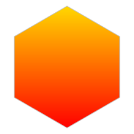

<!-- README.md is generated from README.Rmd. Please edit that file -->

# svgfilter 

<!-- badges: start -->


<!-- badges: end -->

`svgfilter` provides some basic SVG filters.

Because github sanitises SVG to remove some elements of style, scripting
and animation, please see the [svgfilter pkgdown
website](https://coolbutuseless.github.io/package/svgfilter/index.html)
to view the animations.

Creating interesting filters is a bit of an art-form, so this package
provides a few simple filters to show how they operate.

This packages is not at all meant to be a comprehensive set of all
possible filters, but merely some examples to show the way.

The following filters are provided in this package:

  - Turbulent displacement (as shown in the hex logo) -
    `create_filter_turbulent_displacement()`
  - Gaussian Blur - `create_filter_blur()`
  - Drop Shadow - `create_filter_drop_shadow()`

## Installation

You can install from
[GitHub](https://github.com/coolbutuseless/svgfilter) with:

``` r
# install.packages("devtools")
devtools::install_github("coolbutuseless/minisvg")   # Build SVG documents with R
devtools::install_github("coolbutuseless/svgfilter") # This package
```

## Blur filter

``` r
my_filter <- create_filter_blur(id = "example-blur")

my_filter$save_full_svg("man/figures/README-eg-blur.svg", height=100, include_declaration = FALSE)
```

<pre><details closed><summary style='color: #4169E1;'> Show/hide SVG text </summary>&lt;filter id="example-blur" x="-20%" y="-20%" width="140%" height="150%"&gt;
  &lt;feGaussianBlur in="SourceGraphic" stdDeviation="3" /&gt;
&lt;/filter&gt;</details></pre>


#### Applying the filter

``` r
doc <- svg_doc(width=300, height = 200)
doc$defs(my_filter)

doc$circle(
  id     = "my circle",
  cx     = 100, 
  cy     = 100,
  r      = 50, 
  fill   = '#002366',
  filter = my_filter
)

doc$save("man/figures/README-doc-blur.svg")
```

<pre><details closed><summary style='color: #4169E1;'> Show/hide SVG text </summary>&lt;?xml version="1.0" encoding="UTF-8"?&gt;
&lt;svg width="300" height="200" viewBox="0 0 300 200" xmlns="http://www.w3.org/2000/svg" xmlns:xlink="http://www.w3.org/1999/xlink"&gt;
  &lt;defs&gt;
    &lt;filter id="example-blur" x="-20%" y="-20%" width="140%" height="150%"&gt;
      &lt;feGaussianBlur in="SourceGraphic" stdDeviation="3" /&gt;
    &lt;/filter&gt;
  &lt;/defs&gt;
  &lt;circle id="my circle" fill="#002366" filter="url('#example-blur')" cx="100" cy="100" r="50" /&gt;
&lt;/svg&gt;</details></pre>


## Drop Shadow filter

``` r
my_filter <- create_filter_drop_shadow(id = "example-drop")

my_filter$save_full_svg("man/figures/README-eg-drop.svg", height=100, include_declaration = FALSE)
```

<pre><details closed><summary style='color: #4169E1;'> Show/hide SVG text </summary>&lt;filter id="example-drop" x="-20%" y="-20%" width="140%" height="150%"&gt;
  &lt;feOffset in="SourceAlpha" dx="10" dy="10" result="offset_output" /&gt;
  &lt;feGaussianBlur in="offset_output" stdDeviation="3" result="blur_output" /&gt;
  &lt;feFlood flood-color="#bbb" result="flood_image" /&gt;
  &lt;feComposite in="flood_image" in2="blur_output" operator="in" result="composite_output" /&gt;
  &lt;feBlend in="SourceGraphic" in2="composite_output" mode="normal" /&gt;
&lt;/filter&gt;</details></pre>


#### Applying the filter

``` r
doc <- svg_doc(width=300, height = 200)
doc$defs(my_filter)

doc$circle(
  id     = "my circle",
  cx     = 100, 
  cy     = 100,
  r      = 50, 
  fill   = '#002366',
  filter = my_filter
)

doc$save("man/figures/README-doc-drop.svg")
```

<pre><details closed><summary style='color: #4169E1;'> Show/hide SVG text </summary>&lt;?xml version="1.0" encoding="UTF-8"?&gt;
&lt;svg width="300" height="200" viewBox="0 0 300 200" xmlns="http://www.w3.org/2000/svg" xmlns:xlink="http://www.w3.org/1999/xlink"&gt;
  &lt;defs&gt;
    &lt;filter id="example-drop" x="-20%" y="-20%" width="140%" height="150%"&gt;
      &lt;feOffset in="SourceAlpha" dx="10" dy="10" result="offset_output" /&gt;
      &lt;feGaussianBlur in="offset_output" stdDeviation="3" result="blur_output" /&gt;
      &lt;feFlood flood-color="#bbb" result="flood_image" /&gt;
      &lt;feComposite in="flood_image" in2="blur_output" operator="in" result="composite_output" /&gt;
      &lt;feBlend in="SourceGraphic" in2="composite_output" mode="normal" /&gt;
    &lt;/filter&gt;
  &lt;/defs&gt;
  &lt;circle id="my circle" fill="#002366" filter="url('#example-drop')" cx="100" cy="100" r="50" /&gt;
&lt;/svg&gt;</details></pre>


## Turbulent Displacement Filter (with animation)

This is quite a complex filter which is made up of the following
elements:

  - create some random turbulence
  - generate a number of different versions of the turbulence by
    changing the random seed
  - use the turbulence to displace the element the filter is applied to.

The user can specify the frequency of the noise in the x and y
directions and other noise parameters, such as the scale factor used for
the displacement.

``` r
my_filter <- create_filter_turbulent_displacement(
  id    = "example-turbulence", 
  freqx = 0.10, 
  freqy = 0.01,
  scale = 20
)
```

<pre><details closed><summary style='color: #4169E1;'> Show/hide SVG text </summary>&lt;filter id="example-turbulence" x="-30%" y="-30%" width="160%" height="160%"&gt;
  &lt;feTurbulence type="turbulence" baseFrequency="0.1 0.01" numOctaves="4" seed="1" result="turbulence"&gt;
    &lt;animate attributeName="seed" dur="2.5" repeatCount="indefinite" calcMode="discrete" values="1;2;3;4;5;6;7;8;9;10;11;12;13;14;15;16;17;18;19;20;1" keyTimes="0;0.05;0.1;0.15;0.2;0.25;0.3;0.35;0.4;0.45;0.5;0.55;0.6;0.65;0.7;0.75;0.8;0.85;0.9;0.95;1" /&gt;
  &lt;/feTurbulence&gt;
  &lt;feDisplacementMap in="SourceGraphic" in2="turbulence" scale="20" xChannelSelector="R" yChannelSelector="G" /&gt;
&lt;/filter&gt;</details></pre>

``` r
my_filter$show()
```


#### Applying the filter

``` r
doc <- svg_doc(width=300, height = 200)
doc$defs(my_filter)

doc$circle(
  id     = "my circle",
  cx     = 100, 
  cy     = 100,
  r      = 50, 
  fill   = '#002366',
  filter = my_filter
)

doc$save("man/figures/README-doc-turbulence.svg")
```

<pre><details closed><summary style='color: #4169E1;'> Show/hide SVG text </summary>&lt;?xml version="1.0" encoding="UTF-8"?&gt;
&lt;svg width="300" height="200" viewBox="0 0 300 200" xmlns="http://www.w3.org/2000/svg" xmlns:xlink="http://www.w3.org/1999/xlink"&gt;
  &lt;defs&gt;
    &lt;filter id="example-turbulence" x="-30%" y="-30%" width="160%" height="160%"&gt;
      &lt;feTurbulence type="turbulence" baseFrequency="0.1 0.01" numOctaves="4" seed="1" result="turbulence"&gt;
        &lt;animate attributeName="seed" dur="2.5" repeatCount="indefinite" calcMode="discrete" values="1;2;3;4;5;6;7;8;9;10;11;12;13;14;15;16;17;18;19;20;1" keyTimes="0;0.05;0.1;0.15;0.2;0.25;0.3;0.35;0.4;0.45;0.5;0.55;0.6;0.65;0.7;0.75;0.8;0.85;0.9;0.95;1" /&gt;
      &lt;/feTurbulence&gt;
      &lt;feDisplacementMap in="SourceGraphic" in2="turbulence" scale="20" xChannelSelector="R" yChannelSelector="G" /&gt;
    &lt;/filter&gt;
  &lt;/defs&gt;
  &lt;circle id="my circle" fill="#002366" filter="url('#example-turbulence')" cx="100" cy="100" r="50" /&gt;
&lt;/svg&gt;</details></pre>


## Creating the logo for this package

``` r
#~~~~~~~~~~~~~~~~~~~~~~~~~~~~~~~~~~~~~~~~~~~~~~~~~~~~~~~~~~~~~~~~~~~~~~~~~~~~~
# Building an SVG logo with an animated stripe
#~~~~~~~~~~~~~~~~~~~~~~~~~~~~~~~~~~~~~~~~~~~~~~~~~~~~~~~~~~~~~~~~~~~~~~~~~~~~~
logo <- svg_doc(width = 220, height = 220)

#~~~~~~~~~~~~~~~~~~~~~~~~~~~~~~~~~~~~~~~~~~~~~~~~~~~~~~~~~~~~~~~~~~~~~~~~~~~~~
# Create a rotating striped pattern and add it to the '<defs>' 
#~~~~~~~~~~~~~~~~~~~~~~~~~~~~~~~~~~~~~~~~~~~~~~~~~~~~~~~~~~~~~~~~~~~~~~~~~~~~~
turbulent_displacement_filter <- svgfilter::create_filter_turbulent_displacement(
  id = "tdfilter",
  scale = 20
)

gradient_pattern <- svgpatternsimple::create_pattern_gradient(
  id = "red-gradient",
  colour1 = 'red',
  colour2 = 'gold',
  angle   = 90
)

logo$defs(gradient_pattern)
logo$defs(turbulent_displacement_filter)

#~~~~~~~~~~~~~~~~~~~~~~~~~~~~~~~~~~~~~~~~~~~~~~~~~~~~~~~~~~~~~~~~~~~~~~~~~~~~~
# Create a hexagon filled with this pattern, and add it to the document
#~~~~~~~~~~~~~~~~~~~~~~~~~~~~~~~~~~~~~~~~~~~~~~~~~~~~~~~~~~~~~~~~~~~~~~~~~~~~~
len     <- 100
angles  <- (seq(0, 360, 60) + 90) * pi/180
xs      <- round(len * cos(angles) + 110, 2)
ys      <- round(len * sin(angles) + 110, 2)
hex     <- stag$polygon(id = 'hex', xs = xs, ys = ys)

hex$update(stroke = '#c0c0c0', filter = turbulent_displacement_filter,
           fill = gradient_pattern)
# hex$update(stroke = 'black', fill_opacity = 0)

logo$append(hex)

# logo$show()
logo$save("man/figures/logo.svg")
```

<pre><details closed><summary style='color: #4169E1;'> Show/hide SVG text </summary>&lt;?xml version="1.0" encoding="UTF-8"?&gt;
&lt;svg width="220" height="220" viewBox="0 0 220 220" xmlns="http://www.w3.org/2000/svg" xmlns:xlink="http://www.w3.org/1999/xlink"&gt;
  &lt;defs&gt;
    &lt;linearGradient id="red-gradient" x1="0%" y1="100%" x2="0%" y2="0%"&gt;
      &lt;stop offset="0%" style="stop-color:red;stop-opacity:1" /&gt;
      &lt;stop offset="100%" style="stop-color:gold;stop-opacity:1" /&gt;
    &lt;/linearGradient&gt;
  &lt;/defs&gt;
  &lt;defs&gt;
    &lt;filter id="tdfilter" x="-30%" y="-30%" width="160%" height="160%"&gt;
      &lt;feTurbulence type="turbulence" baseFrequency="0.05" numOctaves="4" seed="1" result="turbulence"&gt;
        &lt;animate attributeName="seed" dur="2.5" repeatCount="indefinite" calcMode="discrete" values="1;2;3;4;5;6;7;8;9;10;11;12;13;14;15;16;17;18;19;20;1" keyTimes="0;0.05;0.1;0.15;0.2;0.25;0.3;0.35;0.4;0.45;0.5;0.55;0.6;0.65;0.7;0.75;0.8;0.85;0.9;0.95;1" /&gt;
      &lt;/feTurbulence&gt;
      &lt;feDisplacementMap in="SourceGraphic" in2="turbulence" scale="20" xChannelSelector="R" yChannelSelector="G" /&gt;
    &lt;/filter&gt;
  &lt;/defs&gt;
  &lt;polygon points="110,210 23.4,160 23.4,60 110,10 196.6,60 196.6,160 110,210" id="hex" stroke="#c0c0c0" filter="url('#tdfilter')" fill="url('#red-gradient')" /&gt;
&lt;/svg&gt;</details></pre>


